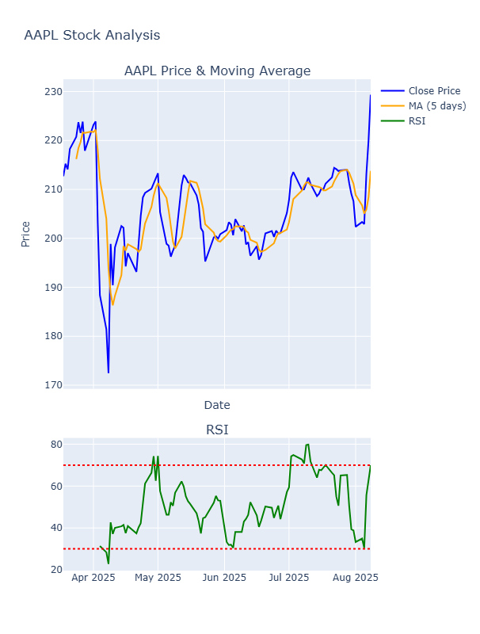
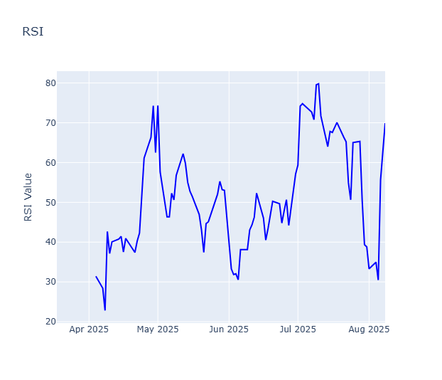
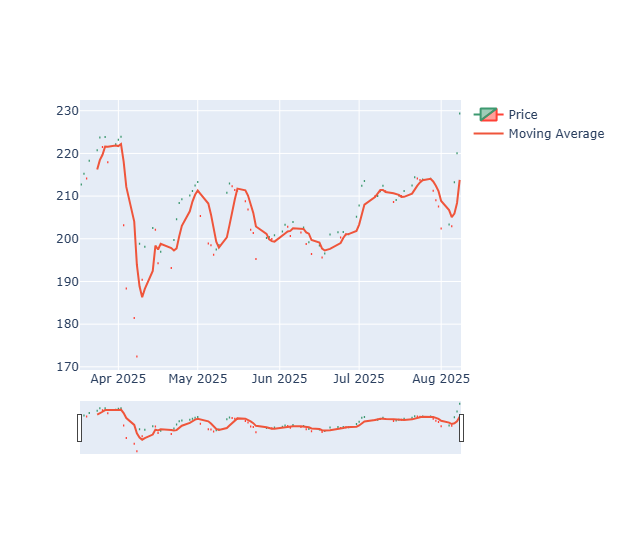

📈 Stock Price Tracker & Analysis
A Python project that fetches live & historical stock data from Yahoo Finance, stores it in MySQL, performs technical analysis (Moving Average & RSI), and visualizes it with Plotly interactive charts.

🚀 Features
Fetch OHLCV (Open, High, Low, Close, Volume) data for any stock symbol.
Store and update data in MySQL with no duplicates.
Calculate Moving Average and Relative Strength Index (RSI).
Interactive candlestick + RSI charts using Plotly.

🛠 Tech Stack
Python (pandas, yfinance, plotly, mysql-connector-python)
MySQL for data storage
Plotly for visualization

📊 Example Output
Candlestick chart with Moving Average overlay.
RSI indicator in the same interactive chart.

AAPL CHART

RSI (Relative Strength Index)

 Trend Analysis

